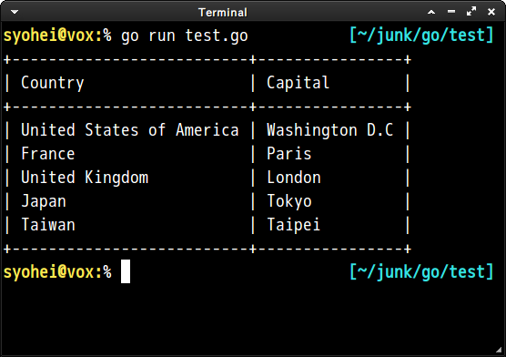
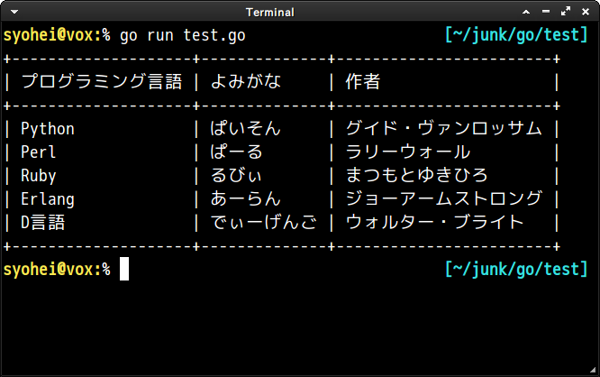

# go-texttable

## Sample Code

```go
package main

import "github.com/syohex/go-texttable"
import "fmt"

func main () {
	tbl := &texttable.TextTable{}
	tbl.SetHeader([]string{"Country", "Capital"})

	tbl.AddRow([]string{"United States of America", "Washington D.C"})
	tbl.AddRow([]string{"France", "Paris"})
	tbl.AddRow([]string{"United Kingdom", "London"})
	tbl.AddRow([]string{"Japan", "Tokyo"})
	tbl.AddRow([]string{"Taiwan", "Taipei"})

	fmt.Println(tbl.Draw())
}

```

Output of above code is




`go-texttable` also supports multibyte characters such as Japanese.

```go
package main

import "github.com/syohex/go-texttable"
import "fmt"

func main () {
	tbl := &texttable.TextTable{}
	tbl.SetHeader([]string{"プログラミング言語", "よみがな", "作者"})

	tbl.AddRow([]string{"Python", "ぱいそん", "グイド・ヴァンロッサム"})
	tbl.AddRow([]string{"Perl", "ぱーる", "ラリーウォール"})
	tbl.AddRow([]string{"Ruby", "るびぃ", "まつもとゆきひろ"})
	tbl.AddRow([]string{"Erlang", "あーらん", "ジョーアームストロング"})
	tbl.AddRow([]string{"D言語", "でぃーげんご", "ウォルター・ブライト"})

	fmt.Println(tbl.Draw())
}
```


